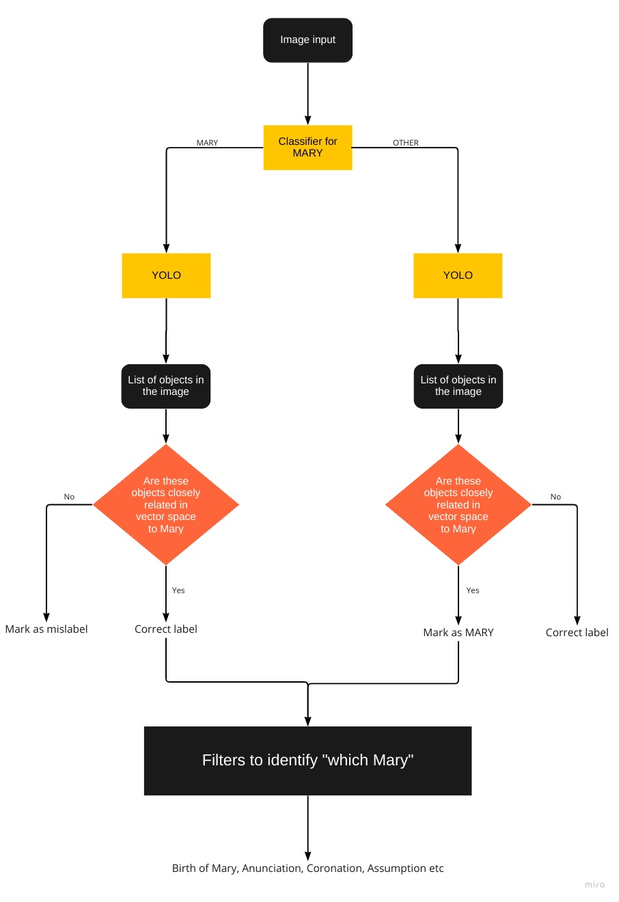

# EmileMaleV4

Version 4 of the Emile Male pipeline. This document explains the input format, how to use and output format of this version of the pipeline. To use this pipeline make sure that you have a directory of the name data/ with a subdirectory images/ which contains all the images. Labels of the images are not required.

## What's new?

Added a new module that tries to distinguish between different stories of Mother Mary. The pipeline looks something like this - 



Current format handles these stories of Mother Mary - ['item', 'birth_virgin', 'marriage', 'annunciation', 'birth_jesus', 'adoration', 'coronation', 'assumption', 'death', 'virgin_and_child']

## How does it work? 

I have used the tallying method to score for each class. For example, if a lamb is seen in the image, we add a point to the class 'birth_of_jesus'. If we see a crown, we add a point to 'Virgin_with_child' and 'Coronation' of the Virgin. 

I have also tried to include pose approximation in this module. For example, if there is person who has their hand extending away from their body it might represent Marriage of the virgin, so we give a point to that class. 

Note - There are many 'stories'(classes) which have not being included and also, might be impossible to include because of the vastness of the subject. However, this method has promise, [see](https://github.com/ParthS28/gsoc22-christian-iconography/blob/master/presentations/Meeting_31_8.pdf). Further work can focus on making this module better or even add modules for other figures like St. John or St. Sebastian etc.

## Input 

When running the pipeline, the data should be available in this format.

```
data/
|_____images/
|     |____xyz.jpg
|          .
|          .
```

images will contain all the images in .jpg format.

## How to run

The pipeline will be executed in the singularity format. 
```
singularity pull emilemale.sif docker://ghcr.io/parths28/emilemale:latest
```

After that run the script
```
#!/bin/bash

module load singularity/3.8.1

mkdir emilemale
cp -r data/ emilemale/
cd emilemale
rsync -az <yourid>@rider.case.edu:/mnt/rds/redhen/gallina/home/pas193/EmileMaleV4/ .
rsync -az <yourid>@rider.case.edu:/mnt/rds/redhen/gallina/home/pas193/singularity/emilemale.sif .

singularity exec -e -B /mnt/rds/redhen/gallina/home/pas193/test4/emilemale emilemale.sif ./run.sh

mv out1.csv ../.
mv out2/ ../out2
mv out3.csv ../
mv class_prediction.csv ../

cd ..
rm -rf emilemale


```

## Output

All three stages of the pipeline provide their output separately. 

out1.csv - output from the baseline classifier. CSV format with columns - item, predicted.

out2 - Directory containing all the annotations produced by YOLO. Text file and images included.

out3.csv - Final output of the pipeline. CSV format with columns - item, stage1_prediction, final_prediction.

class_prediction.csv - A csv document describing the probability score of classes for that image. Columns - ['item', 'birth_virgin', 'marriage', 'annunciation', 'birth_jesus', 'adoration', 'coronation', 'assumption', 'death', 'virgin_and_child']